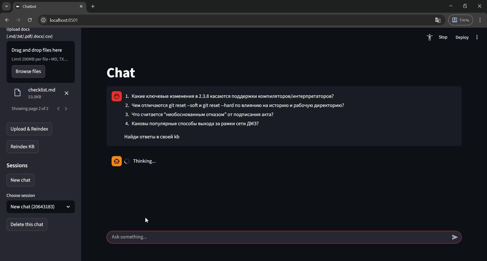
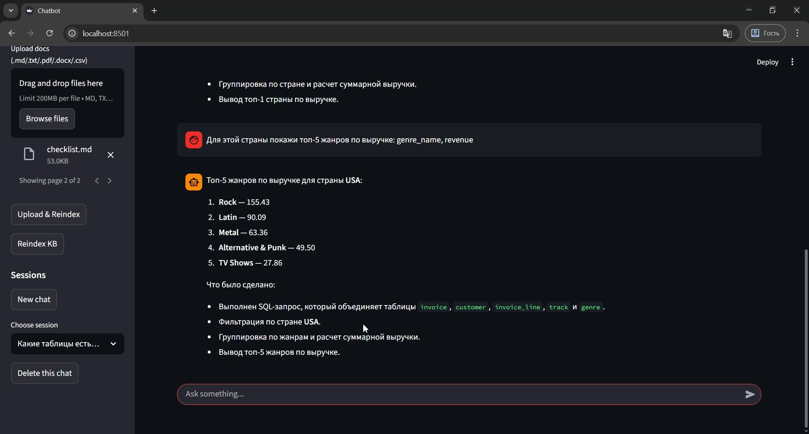
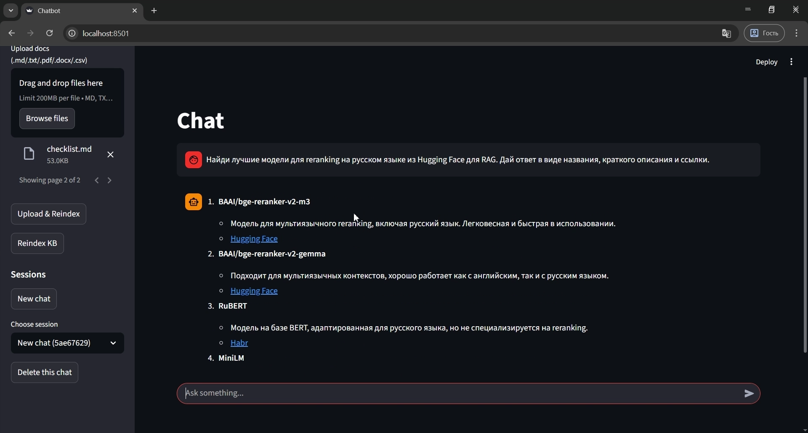

# Multi-Agent Chatbot — Agentic RAG + SQL + Web

## Краткое описание и стек

**Multi-Agent Chatbot** — проект агентной системы с маршрутизацией запросов (planner) и тремя специализированными исполнителями (executors):  
1) **KB/RAG агент** для ответов по локальной базе знаний (knowledge base),  
2) **DB агент** для работы с данными в PostgreSQL через SQL-tools,  
3) **WEB агент** для поиска актуальной информации в интернете.

Проект реализован в виде **API-сервиса на FastAPI** и **интерфейса на Streamlit**. История диалогов хранится в **Redis**, данные — в **PostgreSQL**, файлы в базе знаний форматов md/txt/docx/pdf/csv. Оркестрация логики агентов выполнена через **LangGraph**, инструменты (tools) — через **LangChain**.

**Технологии:**
- Python 3.10+
- LangGraph (planner + executors, routing)
- LangChain (tools, SQLDatabaseToolkit, TavilySearch)
- RAG: hybrid retrieval (BM25 + dense embeddings) + опциональный rerank локальной моделью
- FAISS vector database
- FastAPI + Uvicorn
- Streamlit (минимальный UI)
- PostgreSQL (Docker)
- Redis (Docker, история диалогов)
- OpenRouter API (LLM для planner и executors)






## Подробное описание

### 1) Общая архитектура

Система построена по схеме **Planner → Executor**:

- **Planner (маршрутизатор)** анализирует пользовательский запрос и выбирает один маршрут:
  - `KB` — вопрос о документации, инструкциях, ошибках, конфигурации, правилах работы сервиса и т.п.
  - `DB` — вопрос о таблицах, SQL-запросах, данных в PostgreSQL.
  - `WEB` — запрос на актуальную/внешнюю информацию, либо случаи, когда в KB нет ответа.

- **Executors (исполнители)** строго ограничены своим набором инструментов:
  - KB executor использует только `kb_*` tools.
  - DB executor использует только `sql_db_*` tools (через LangChain SQLDatabaseToolkit).
  - WEB executor использует только web-search tools (Tavily).

Логика orchestrations реализована как **LangGraph StateGraph** с условным переходом (conditional edge):
- `planner → (kb | db | web)`


### 2) Планировщик (Planner)

Planner выполняет маршрутизацию в два этапа:

1) **Быстрая эвристика**  
   На основе ключевых слов и паттернов:
   - признаки DB: `select`, `insert`, `update`, `delete`, `postgres`, `таблица`, `sql`, `schema`, `pg_catalog`
   - признаки WEB: “свежее”, “сегодня”, “новости”, “ссылки”, “найди в интернете”, “url”
   - иначе — маршрут `KB`.

2) **Уточнение через LLM**  
   Применяется в неоднозначных случаях (когда эвристика выбрала `KB`). LLM получает строгую инструкцию вернуть только одно значение: `KB`, `DB` или `WEB`. Это повышает качество и скорость маршрутизации без постоянных затрат на LLM вызовы.

## 3) RAG-система (KB executor)

RAG является ключевой частью проекта и реализован как практический пайплайн, ориентированный на эксплуатационные сценарии (troubleshooting, инструкции, чеклисты, заметки).

### 3.1 Формат данных KB

База знаний хранится локально в директории `kb/`. Поддерживаются файлы:
- `.md`
- `.txt`
- `.pdf`
- `.docx`
- `.csv`

После загрузки документов выполняется индексация (reindex). В интерфейсе Streamlit предусмотрена кнопка загрузки документов с автоматическим переиндексированием.

### 3.2 Чанкинг

Каждый документ разбивается на чанки фиксированного размера:
- `chunk_max_chars` — максимальный размер чанка по символам
- `chunk_overlap_chars` — перекрытие между чанками

Перекрытие снижает риск потери контекста на границах чанков и повышает полноту ответов при извлечении.

### 3.3 Индексация

Индексация формирует **двойную поисковую структуру**:

#### A) Лексический индекс (BM25)
BM25 хорошо работает для:
- команд, параметров, ключевых слов из логов
- названий ошибок, версий, конфигураций

#### B) Семантический индекс (dense embeddings)
Dense embeddings обеспечивают:
- поиск по смыслу
- извлечение релевантного контекста, даже если в вопросе нет точных совпадений

Векторный поиск реализуется через FAISS.

### 3.4 Hybrid retrieval (BM25 + Dense)

При поступлении запроса выполняется **retrieval**:

1) BM25 возвращает `topN_bm25` кандидатов
2) Dense retrieval возвращает `topN_dense` кандидатов
3) Результаты объединяются и сортируются по гибридному скору:

- выполняется нормализация скорингов
- итоговый скор строится как взвешенная комбинация:
  - `hybrid_score = alpha * bm25_score + (1 - alpha) * dense_score`
  - параметр `hybrid_alpha` регулирует баланс:
    - `alpha ближе к 1.0` усиливает BM25 (точные совпадения)
    - `alpha ближе к 0.0` усиливает dense retrieval (семантика)

Цель hybrid retrieval — получить стабильные результаты как для “технических” запросов с точными терминами, так и для естественных вопросов пользователя.

### 3.5 Rerank (опционально)

После hybrid retrieval возможно применение reranking:
- берётся топ кандидатов
- выполняется переупорядочивание с помощью локальной лёгкой rerank-модели (например, Cross-Encoder)
- выбирается финальный top-k

Rerank особенно полезен, когда:
- несколько чанков выглядят одинаково релевантными
- требуется более точная ранжировка и снижение “шумных” попаданий

### 3.6 Генерация ответа и источники

KB executor:
1) вызывает `kb_search` по исходному вопросу
2) получает hits с текстом чанков и источниками
3) формирует ответ на основе извлечённого контекста

## 4) DB executor (PostgreSQL через SQLDatabaseToolkit)

DB агент предназначен для выполнения задач по данным:

- перечисление таблиц, просмотр схемы
- выполнение SELECT для получения данных
- выполнение UPDATE/INSERT/DELETE для изменения данных
- последующий SELECT для проверки результата

Инструменты DB агента предоставляются через **LangChain SQLDatabaseToolkit**, что упрощает поддержку, повторное использование и расширение.

## 5) WEB executor (Tavily)

WEB агент выполняет интернет-поиск через Tavily и возвращает:
- краткий ответ
- список ссылок (3–5) для проверки и перехода к первоисточникам

Используется для:
- запросов, требующих актуальной информации
- случаев, когда в KB отсутствует релевантный контент

## 6) Память и сессии (Redis)

История диалогов хранится в Redis (RedisChatMessageHistory).  
Поддерживаются:
- множественные диалоги (разные `session_id`)
- список диалогов (с авто-title)
- удаление диалога
- синхронизация истории при выборе диалога в UI

История диалогов в Redis используется не только для отображения пользователю, но и передаётся в контекст модели для улучшения связности диалога.

## 7) API и UI

### 7.1 FastAPI
Набор эндпоинтов:
- `POST /reindex` — переиндексация KB
- `POST /sessions` — создать диалог
- `GET /sessions` — список диалогов
- `GET /sessions/{id}` — история диалога
- `DELETE /sessions/{id}` — удалить диалог
- `POST /sessions/{id}/ask` — задать вопрос агентной системе

### 7.2 Streamlit
UI включает:
- выбор/создание/удаление диалога
- чат-интерфейс для вопросов
- reindex файлов в knowledge base
- загрузку документов в KB + автоматический reindex

## Инструкция по запуску

### 1) Требования
- Python 3.10+
- Docker + Docker Compose
- API ключи:
  - OpenRouter (для LLM)
  - Tavily (для web search)

### 2) Поднять Postgres и Redis (Docker)
```bash
docker compose up -d
```

### 3) Ввести собственные ключи OPENROUTER_API_KEY и TAVILY_API_KEY в окружении .env, также настроить подключение к базе данных через POSTGRES_URL, POSTGRES_USER, POSTGRES_PASSWORD и POSTGRES_DB

### 4) Установка зависимостей
```bash
python -m venv .venv
.\.venv\Scripts\activate
pip install -r requirements.txt
```

### 5) Запуск API
```bash
uvicorn app.main:app --reload --host 127.0.0.1 --port 9000
```

### 6) Запуск Streamlit (в другом терминале)
```bash
streamlit run streamlit_app.py
```

